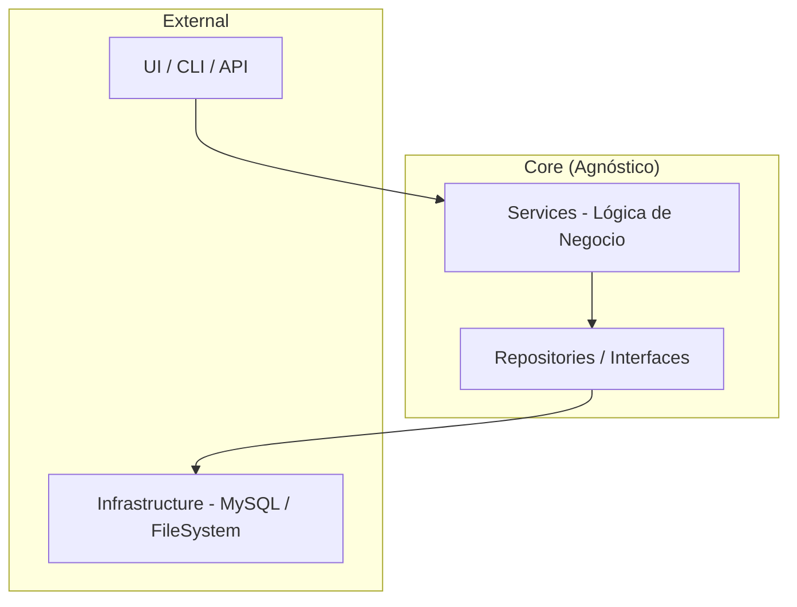

# 📖 Manual Maestro: CRM Industrial SaaS (Clean Architecture)

## 🏛️ 1. Arquitectura del Sistema

El sistema sigue los principios de **Clean Architecture**, garantizando que el núcleo de negocio sea independiente de las tecnologías externas.

### 📐 Capas de la Aplicación



### 📂 Estructura del Proyecto

- **`backend/`**: Núcleo en Python.
  - `src/`: Lógica, modelos y repositorios.
  - `src/modules/`: Módulos de negocio activables (ej: `business_pipeline`).
  - `lib/shared_auth/`: Módulo de seguridad y autenticación compartida.
- **`frontend/`**: Interfaz de usuario dinámica (Vite + Vanilla JS).
- **`database/`**: Gestión de esquemas.
  - `core_template.sql`: ADN mínimo del sistema.
  - `modules/`: Plugins de base de datos (ej: `business_pipeline.sql`).
  - `scripts/`: Scripts de mantenimiento.
- **`docs/`**: Documentación centralizada y diagramas.

---

## 💾 2. Persistencia y Multitenancy

### Independencia de Datos (DB Agnostic)

Gracias a la interfaz `IDatabase`, el sistema es agnóstico al motor de base de datos.

- **Ubicación**: `src/core/database_interface.py`
- **Implementación**: `src/core/mysql_repository.py`

### Concepto de Doble Registro

1. **Registro Global (`master_db`)**: Almacena identidades en `global_users` para enrutamiento.
2. **Registro Local (Instancia Privada)**: Cada tenant tiene su propia BD (`crm_user_X`) para aislamiento total de datos.

---

## 🚀 3. Flujo de Aprovisionamiento y Login

### Registro de Nuevo Tenant

1. **Validación**: Se verifica el RUT (algoritmo DIAN) y disponibilidad de `username`.
2. **Global**: Inserción en `master_db.global_users`.
3. **Instancia**: `CREATE DATABASE` e inicialización mediante `plantilla_crm.sql`.
4. **Local**: Creación del usuario Admin en la instancia privada.
5. **Vinculación**: Registro en `master_db.tenants`.

### Sistema de Broadcast (Mantenimiento Masivo)

Permite ejecutar comandos en cascada sobre todos los tenants activos, cambiando el contexto de base de datos dinámicamente mediante `switch_database(db_name)`.

---

## 🏗️ 4. Ecosistema de Módulos (Plugins SQL On-Demand)

El sistema soporta la activación dinámica de funcionalidades mediante el servicio `install_module(tenant_id, module_name)`.

### Flujo de Activación:

1. **Identificación**: Se busca el script `.sql` en `database/modules/`.
2. **Ejecución Atómica**: Se aplica el script sobre la base de datos del cliente dentro de una transacción.
3. **Registro**: Se actualiza `master_db.tenant_modules` para habilitar el acceso desde el backend.
4. **Rollback**: Si falla el SQL, no se registran cambios ni en el tenant ni en la master.

### Módulos Disponibles:

- **`business_pipeline`**: Gestión de prospectos, etapas de trato y cotizaciones.
- **`inventory`** (Próximamente): Control de stock y almacenes.
- **`data_analytics`** (Próximamente): Dashboards avanzados de BI.

---

## ⚙️ 5. Configuración de Entorno (.env)

| Variable         | Descripción                       | Valor Ejemplo      |
| :--------------- | :-------------------------------- | :----------------- |
| `PORT`           | Puerto del Backend (API).         | `5000`             |
| `DB_HOST`        | Dirección del servidor de DB.     | `localhost`        |
| `DB_USER`        | Usuario con permisos de creación. | `root`             |
| `DB_PASSWORD`    | Contraseña de acceso.             | `********`         |
| `DB_PORT`        | Puerto MySQL.                     | `3306`             |
| `MASTER_DB_NAME` | BD del directorio global.         | `crm_master`       |
| `SECRET_KEY`     | Semilla para JWT.                 | `mi_llave_secreta` |
| `TOKEN_EXP_MIN`  | Expiración de sesión (min).       | `60`               |

---

## 🛑 5. Diccionario de Errores Estandarizados

| Código       | Causa            | Mensaje Frontend                        |
| :----------- | :--------------- | :-------------------------------------- |
| **1062**     | Duplicado        | "El RUT o Email ya existe."             |
| **1451/2**   | Llave Foránea    | "Registro con datos asociados."         |
| **3819**     | Check Constraint | "Dato inválido según reglas del campo." |
| **AUTH_001** | Bloqueo          | "Cuenta bloqueada por fuerza bruta."    |

---

## 🏗️ 6. Guía para el Desarrollador (Clean Code)

### Reglas de Oro

1. **Inyección de Dependencias**: Reciba siempre la persistencia en el `__init__`.
2. **Transacciones**: Use `with self.persistence.start_transaction():` para atomicidad.
3. **Validación de RUT**: Implementada con algoritmo de Módulo 11 en `security.py`.
4. **Higiene de Datos**: Use `DataHygieneService` para Soft Delete y deduplicación.

### Ejemplo: Entidad Proveedor

```python
# Servicio consume interfaz inyectada
class ProviderService:
    def __init__(self, repo: IProviderRepository):
        self.repo = repo

    def register(self, provider_data):
        return self.repo.save(provider_data)
```

---

## 💾 7. Backup y Restauración

### Generar Backup

```bash
mysqldump -u root -p crm_master > full_backup.sql
```

### Restauración

1. Cree la DB maestra usando `database/master_db.sql`.
2. Importe `database/core_template.sql` en cada nueva instancia para inicializar el núcleo.
3. Use `install_module` para añadir funcionalidades adicionales.

---

## 🌐 8. Gestión de Red y Puertos

El sistema utiliza un sistema de configuración centralizado mediante un archivo `.env` en la raíz del proyecto. Esto permite cambiar puertos y URLs sin modificar el código fuente.

### 🔌 Variables Principales

Localizadas en el archivo `.env` maestro:

- `BACKEND_PORT`: Puerto donde escucha la API Python (Default: 8000).
- `FRONTEND_PORT`: Puerto donde vive la interfaz Vite (Default: 3000).
- `BASE_URL`: Protocolo y host (Default: http://localhost).

### 🛠️ Utilidad de Cambio Rápido

Para modificar la red de forma segura sin editar archivos manualmente y validando que los puertos estén libres, use:

```bash
python update_env.py [LLAVE] [VALOR]
```

_Ejemplo:_ `python update_env.py BACKEND_PORT 9000` (Actualizará automáticamente las variantes VITE\_ necesarias).

### 🚀 Preparación para Producción

1. Actualice la `BASE_URL` con su dominio (ej: `https://api.miempresa.com`).
2. El sistema propagará este cambio automáticamente al frontend mediante el puente `runtime_config.js`.

---

## 🔐 9. Recuperación de Contraseña (Flujo por Email)

El sistema ahora soporta el restablecimiento de clave mediante un código PIN transaccional (Token) enviado por correo electrónico real usando SMTP:

### ¿Cómo probarlo?
1. Inicie su aplicación Frontend e ingrese a la pantalla de Autenticación.
2. Dé clic a "Olvidé mi contraseña".
3. Digite el nombre de usuario (ej: `jhonier264`) o su correo electrónico y presione **Enviar Código**.
4. ¡El sistema backend usará el `EmailService` para enviar un PIN de 6 caracteres a la bandeja de entrada usando las credenciales del `.env`!
5. En la nueva interfaz de "Reset" que aparecerá automáticamente, digite el código que recibió, la nueva clave y confirme la clave. Si todo es correcto, la recuperación será exitosamente completada.

_Ultima actualización: 2026-03-25. Módulo Full Auth Email SMTP Integrado._
